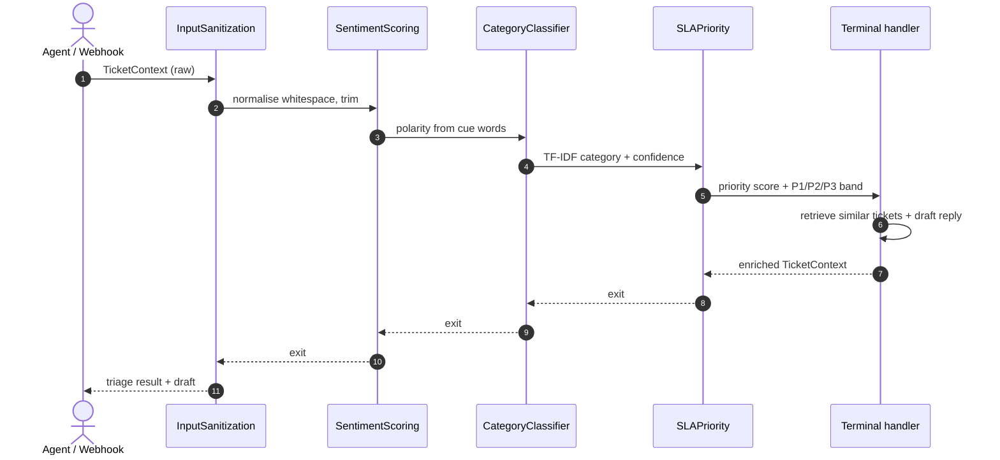

<div align="center">


</div>

# SupportPilot — Support Triage & Drafting

**Turn a raw support ticket into a routed, prioritised, and pre-drafted reply.** SupportPilot classifies each ticket, scores its SLA priority from a transparent scorecard, retrieves the most similar past tickets, and drafts a grounded reply an agent can edit before sending. The enrichment pipeline is built as an **onion middleware stack** — the same request-in / response-out pattern as ASGI — so each triage stage is a self-contained, reorderable layer.

<div align="center">

[](https://www.python.org/)
[](https://fastapi.tiangolo.com/)
[](https://pytest.org/)
[](https://opensource.org/licenses/MIT)

</div>

---

## The problem

A support inbox is a firehose. Before anyone can reply, each ticket has to be cleaned up, read for tone, routed to the right queue, ranked against everything else waiting, and checked against what the team already knows. Doing that by hand is slow and inconsistent; hard-coding it as one long function is worse — inserting a guardrail or an audit step means rewiring everything downstream.

SupportPilot treats triage as a **composable pipeline**. Each concern — sanitisation, sentiment, classification, priority — is an independent layer that wraps the next one, can read and mutate the ticket on the way in *and* on the way back out, and can short-circuit the whole stack (a rate limiter or policy block just doesn't call the next layer). Adding or reordering a stage is a one-line change.

## What it does

Given a ticket (text, customer plan, sentiment), SupportPilot returns:

- **Category** — one of six queues (`billing`, `bug`, `how_to`, `account_access`, `feature_request`, `performance`) with a calibrated confidence and runner-up alternatives.
- **Priority** — a `0–1` score and an SLA band (`P1`/`P2`/`P3`) from a transparent scorecard, so a support lead can defend queue order.
- **Similar tickets** — the closest resolved cases via hybrid retrieval, each carrying its resolution category.
- **Draft reply** (optional) — a suggested response grounded in knowledge-base articles, produced by a swappable LLM provider. It assists; it never auto-sends.

## How it works

The enrichment stages are composed as an onion: the request flows inward through each layer to a terminal handler, then the response unwinds back out through the same layers.



- **`TicketContext`** (`middleware/context.py`) — the mutable dataclass that flows through the stack, accumulating `sanitized_text`, `sentiment`, `category`, `priority_band`, `retrieved_kb`, `draft_reply`, and a `trace` of enter/exit events for auditability.
- **`MiddlewareStack`** (`middleware/base.py`) — `.use(layer)` registers layers; `.build(terminal)` wraps them around a terminal handler in the onion order. Layers implement one `__call__(ctx, call_next)` method.
- **Concrete layers** (`middleware/layers.py`) — `InputSanitization`, `SentimentScoring`, `CategoryClassifier`, `SLAPriority`. They delegate the heavy lifting to the `triage` module, so the same logic backs both the pipeline and the API.

> The FastAPI `/triage` endpoint orchestrates the same stages directly; the `MiddlewareStack` is the reusable composition abstraction (exercised end-to-end in the test suite, including short-circuiting).

## Staged triage

`/triage` runs the whole pass before it answers anything, so the agent waits on
the slowest part of it. The stages are wildly uneven:

| Stage | Work |
|---|---|
| `classify` | TF-IDF + calibrated linear model, local |
| `priority` | the scorecard, arithmetic on three cues |
| `similar` | lexical + embedding retrieval over resolved tickets |
| `draft_reply` | **a call out to a language model** |

`/triage/stream` emits each stage as it completes, so the category and the queue
position reach a human immediately rather than behind the draft. The stream is
a generator all the way down — the classification is genuinely delivered before
the model has been asked for anything, which a test pins by asserting the
provider has recorded no calls after the first event.

### The gate on the expensive stage

Streaming makes a second thing possible: not running the last stage at all.
A drafted reply is grounded in KB articles chosen by the *predicted* category,
so a low-confidence classification yields a confident-sounding reply grounded in
the wrong article — worse than no reply. `supportpilot.triage.routing` refuses
the draft when:

- the predicted category is one configured as never-auto-replied (`billing` by
  default: money questions get a person), or
- the category confidence is below `min_confidence` (0.55), because the KB the
  reply would cite was selected by a guess.

Over a 1,200-ticket holdout from the synthetic corpus:

```
policy: min_confidence=0.55, never_categories=['billing']
mean category confidence 0.893

  drafted automatically :   918
  escalated to a human  :   282   (23.5% of model calls avoided)

  escalation reasons:
    never_category     206
    low_confidence      76
```

Roughly a quarter of tickets never reach the model, and the agent is told which
rule fired and why. Reproduce with:

```bash
uv run python scripts/routing_study.py
```

An escalated ticket still gets everything cheap: category, priority band, and
similar resolved tickets, which is the precedent a human actually wants.

```bash
curl -N -X POST http://localhost:8090/triage/stream -H 'Content-Type: application/json' \
  -d '{"text": "Production is down and the dashboard 500s on save", "plan": "enterprise", "sentiment": -0.7}'
```

## Methodology

### Classification

TF-IDF over 1–2 word n-grams (`min_df=2`, sublinear tf) feeding a logistic-regression classifier wrapped in `CalibratedClassifierCV` (sigmoid, 3-fold), so the reported confidences are calibrated probabilities rather than raw margins. The synthetic corpus is built with cross-category bleed and typos, so classification is genuine work rather than keyword lookup. A keyword fallback covers the case where no trained model is present.

### Priority scorecard

Priority is a deliberately transparent weighted blend — not a black box — because support leads need to justify queue order:

$$\text{score} = \min\!\big(1,\; w_s \cdot \max(-\text{sentiment}, 0) + w_p \cdot \text{plan} + w_o \cdot \text{outage}\big)$$

where the plan weight is `1.0` for enterprise, `0.35` for pro, `0` for basic, and `outage` is `1` if the text contains outage language ("down", "outage", "urgent", "production", …). Default weights are $w_s = 0.35$, $w_p = 0.30$, $w_o = 0.35$ (in `configs/config.yaml`). Bands: `P1` at ≥ 0.55, `P2` at ≥ 0.30, else `P3`.

### Similar-ticket retrieval

Hybrid search fuses a dense signal (fastembed `all-MiniLM-L6-v2`, cosine over L2-normalised vectors) with lexical BM25 via **Reciprocal Rank Fusion** ($k = 60$), which is robust to either retriever being wrong on its own. Returns the top-k tickets with their categories.

### Grounded drafting

The draft is composed by an LLM provider from the ticket, its triage results, the top similar tickets, and knowledge-base excerpts. KB articles (markdown under `data/kb`) are matched by lightweight token overlap and cited as `[article-name]`; the system prompt instructs the model to escalate rather than invent steps when the KB doesn't cover the issue. Providers are hot-swappable behind a thin `LLMProvider` protocol (`claude`, `ollama`, or a deterministic `fake` for offline dev) selected by the `LLM_PROVIDER` env var — no LangChain, no calling-code changes.

## Getting started

```bash
make install                                    # uv sync --group dev

uv run python scripts/make_synthetic.py         # generate the synthetic ticket corpus
uv run python -m supportpilot.triage.classify   # train the classifier -> data/artifacts/triage.pkl

make api                                         # FastAPI on http://localhost:8090
make ui                                          # Streamlit workbench on http://localhost:8591
```

The `/triage` endpoint needs both the trained model and the ticket corpus (it builds the retrieval index from `data/processed/tickets.parquet`), so run the data + train steps first — otherwise it returns `503`. Training runs are logged to MLflow; browse them with `make mlflow` (http://localhost:5009).

Or with Docker:

```bash
make docker-up                                   # docker compose up --build -d  (api :8090, ui :8591)
```

### Call the API

```bash
curl -s localhost:8090/triage -H 'content-type: application/json' -d '{
  "text": "Production is down for our whole team, error 500 when saving a report. Urgent.",
  "plan": "enterprise",
  "sentiment": -0.6,
  "draft": true,
  "provider": "fake"
}'
```

*Illustrative response shape on synthetic data (values depend on the trained model and seed):*

```json
{
  "classification": { "category": "bug", "confidence": 0.81, "alternatives": [] },
  "priority": { "score": 0.65, "band": "P1" },
  "similar_tickets": [ { "ticket_id": 812, "text": "...", "category": "bug", "score": 0.03 } ],
  "reply": { "draft": "...", "provider": "fake", "kb_used": true }
}
```

## API

| Method | Route | Purpose |
|---|---|---|
| `GET` | `/health` | Liveness check + active LLM provider |
| `POST` | `/triage` | Full pass: classify + priority + similar tickets, plus a draft when `draft: true` |
| `POST` | `/triage/stream` | The same pass as `text/event-stream`, one event per stage, draft last |
| `POST` | `/triage/staged` | The staged pass as one JSON body, with per-stage timings and the routing decision |
| `POST` | `/similar` | Similar resolved tickets for a given text |

## Evaluation

Evaluation runs on the synthetic corpus, so there is a known ground-truth label per ticket. The training script holds out a stratified test split and reports **accuracy** and **macro-F1** for the classifier, logging both (with run params) to MLflow. To reproduce:

```bash
uv run python scripts/make_synthetic.py
uv run python -m supportpilot.triage.classify
```

Numbers are omitted here because they depend on the generated dataset and seed — run the script to produce them for your configuration.

## Testing

```bash
make test                                        # uv run pytest --cov
```

- `test_middleware_pipeline.py` — onion composition, enter/exit tracing, short-circuiting
- `test_triage.py` — classification and the priority scorecard/bands
- `test_retrieval_drafts.py` — hybrid retrieval and grounded drafting
- `test_api.py` — HTTP contract
- `test_realtime_streaming.py` — the staged pass: the routing gate, that the model is not called before the first stage is delivered, that an escalated ticket never reaches it at all, and the SSE contract

## Limitations

- The bundled data is synthetic; the classifier, priority weights, and retrieval would all need recalibration on real ticket distributions.
- Sentiment scoring is a small cue-word heuristic, not a trained model — a stand-in for a real sentiment service.
- KB grounding uses token-overlap matching over a handful of seeded articles; it is not a production retrieval layer.
- Draft quality depends on the configured LLM provider; the default `fake` provider is for offline development only.
- The auto-reply gate is a confidence threshold plus a category denylist, not a learned abstention policy. `min_confidence` was chosen as a round number, not tuned against the cost of a wrong reply.
- Calibrated confidence is not correctness: a ticket can be classified confidently and wrongly, and the gate will let it through.
- The stream is staged, not incremental within a stage. The draft arrives whole rather than token by token, even though the provider contract supports `stream()`.
- The `similar` stage pays a one-off cold start: the first call downloads the ONNX embedding model. Measured on this machine at roughly 215 s cold against 48 ms warm, which is a strong argument for emitting `classify` (about 200 ms) without waiting for it.

## Project structure

```
src/supportpilot/
├── middleware/   # Onion stack: TicketContext, MiddlewareStack, concrete layers (the core pattern)
├── pubsub/       # in-process broker; the subscriber runs the staged pass
├── gateway/      # ticket frame handler and the SSE stage projection
├── triage/       # TF-IDF + calibrated classifier, priority scorecard, training
├── retrieval/    # Hybrid dense + BM25 similar-ticket search with RRF fusion
├── drafts/       # KB-grounded reply drafting
├── llm/          # Swappable provider protocol (claude | ollama | fake)
├── api/          # FastAPI app (main:app) and routes
└── ui/           # Streamlit workbench
scripts/          # Synthetic corpus generator
configs/          # Thresholds, priority weights, paths
```

## License

MIT

---

<div align="center">

**Jackson Marcus** · Senior AI & Machine Learning Engineer

[](https://github.com/jackson-marcus)
[](mailto:wajahatanees41@gmail.com)

</div>
